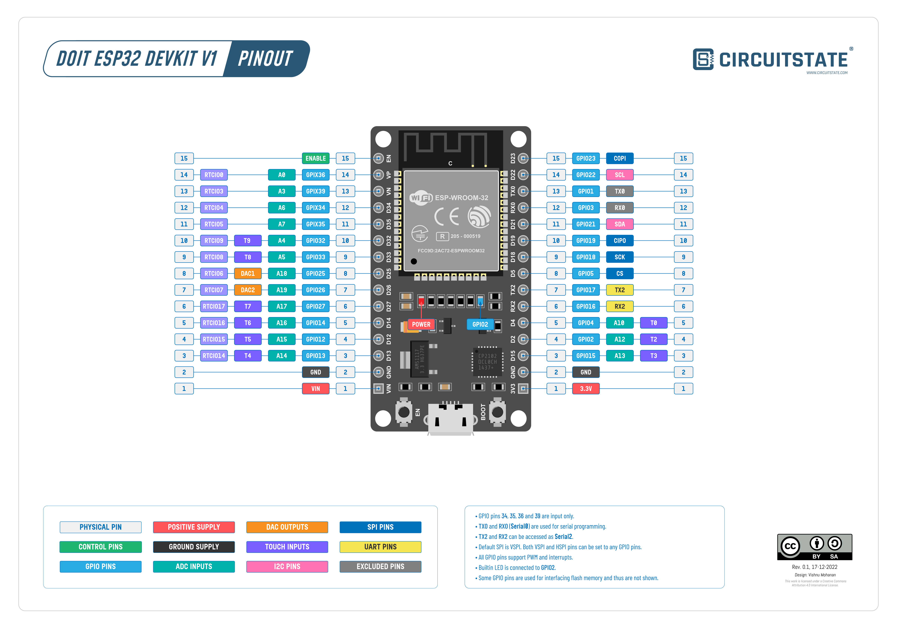

# ESP32 DevKit V1 — Guía honesta de pines para la Máquina Expendedora



---

## Datos generales del board

- **Módulo:** ESP-WROOM-32
- **Total de pines físicos:** 30 (15 por lado)
- **Pines de poder (no GPIO):** 5 → VIN, GND×2, 3.3V, EN
- **GPIOs totales expuestos:** 25
- **Ya reservados (UART al Pi):** 2 → GPIO16 (RX2), GPIO17 (TX2)
- **Disponibles para el proyecto:** 23

---

## Pines de poder — No son GPIO, no conectar señales aquí

| Pin físico | Etiqueta | Uso |
|---|---|---|
| Izq-1 | VIN | Alimentación 5V de entrada |
| Izq-2 | GND | Tierra |
| Der-1 | 3.3V | Salida regulada del LDO (fuente, no GPIO) |
| Der-2 | GND | Tierra |
| Izq-15 | EN | Enable/reset del chip. No es GPIO |

---

## Pines ya reservados — UART Pi ↔ ESP32

| GPIO | Etiqueta | Rol |
|---|---|---|
| GPIO16 | RX2 | Recibe del Pi: `DISPENSE:N`, etc. |
| GPIO17 | TX2 | Responde al Pi: `OK:N`, `WEIGHT:N:g`, etc. |

---

## Clasificación de todos los GPIO disponibles

### ✅ SEGUROS — Sin restricciones (13 pines)

Pueden usarse como entrada o salida sin ningún cuidado especial.
Ideales para motores/transistores, LEDs, sensores, botones.

| GPIO | Capacidades extra | Recomendado para |
|---|---|---|
| GPIO4  | ADC2_CH0, TOUCH0, RTC | Cualquier uso |
| GPIO13 | ADC2_CH4, TOUCH4, HSPI | Salida digital |
| GPIO14 | ADC2_CH6, TOUCH6 | Salida digital |
| GPIO18 | SPI SCK | Salida digital |
| GPIO19 | SPI MISO | Entrada o salida |
| GPIO21 | I2C SDA | Entrada o salida |
| GPIO22 | I2C SCL | Entrada o salida |
| GPIO23 | SPI MOSI | Salida digital |
| GPIO25 | DAC1, ADC2_CH8 | Salida analógica/digital |
| GPIO26 | DAC2, ADC2_CH9 | Salida analógica/digital |
| GPIO27 | ADC2_CH7, TOUCH7 | Salida digital |
| GPIO32 | ADC1_CH4, TOUCH9, RTC | Entrada o salida |
| GPIO33 | ADC1_CH5, TOUCH8, RTC | Entrada o salida |

---

### ⚠️ CON RESTRICCIONES — Usables bajo condiciones

#### GPIO34, GPIO35, GPIO36 (VP), GPIO39 (VN) — Solo entrada

**Restricción:** Input-only. No pueden configurarse como salida. **No tienen pull-up ni pull-down internos.**

| GPIO | ¿Para qué sirve? | Cuidado obligatorio |
|---|---|---|
| GPIO34 | HX711 DATA — el HX711 maneja la línea, no necesita pull-up | No conectar como salida |
| GPIO35 | HX711 DATA | Ídem |
| GPIO36 / VP | HX711 DATA | Ídem |
| GPIO39 / VN | Botón o HX711 DATA | Si es botón: **pull-up externo de 10kΩ a 3.3V obligatorio** |

---

#### GPIO0 — Strapping: modo de boot

**El pin más crítico para el arranque.**

| Estado al encender | Consecuencia |
|---|---|
| HIGH (flotante o pull-up) | Boot normal ✓ |
| LOW | ESP32 entra en modo flash — no corre el firmware ✗ |

Tiene pull-up interno. Un botón conectado aquí (normalmente HIGH, jala a GND al presionar) es **seguro** porque en reposo está HIGH.

**Usar para:** Botón físico con `INPUT_PULLUP`.
**No usar para:** Motor, LED o cualquier salida que pueda estar en LOW al encender.

---

#### GPIO2 — Strapping + LED azul integrado en la placa

**Tiene un LED soldado** entre GPIO2 y GND en el board.

| Estado al encender | Consecuencia |
|---|---|
| Flotante / LOW | Boot y programación USB normales ✓ |
| HIGH | Puede interferir con la descarga de firmware vía USB ✗ |

**Usar para:** Botón físico con `INPUT_PULLUP`. Si se usa como salida (LED externo), el LED azul de la placa también encenderá.
**No usar para:** Motor o salida que deba estar HIGH al encender.

---

#### GPIO5 — Strapping: SDIO + pulso PWM al boot

Al iniciar, el ESP32 emite un **pulso PWM breve en GPIO5** antes de que corra el código del usuario. Tiene pull-up interno.

| Uso | ¿Problema? |
|---|---|
| Como entrada (botón, sensor) | No. El pulso al boot no afecta la lectura |
| Como salida LED | El LED parpadeará brevemente al encender. Tolerable |
| Como salida motor/transistor | El motor puede dar un micro-impulso al encender. **Evitar** |

**Usar para:** Botón físico o LED indicador.
**No usar para:** Motor o transistor que active un actuador.

---

#### GPIO12 (MTDI) — Strapping: voltaje de flash ⚠️ PELIGROSO

Este es el pin más peligroso del ESP32.

| Estado al encender | Voltaje de flash | Consecuencia |
|---|---|---|
| LOW o flotante | 3.3V | Correcto para ESP-WROOM-32 ✓ |
| HIGH | 1.8V | El módulo puede no arrancar, o dañarse permanentemente ✗ |

**Regla de oro:** GPIO12 debe estar en LOW o flotante al encender. Nada que pueda jalarlo a HIGH durante el boot.

**Recomendación real: evitar este pin.** El riesgo de dañar el módulo no vale la pena cuando hay alternativas.

---

#### GPIO15 (MTDO) — Strapping menor: log de boot

| Estado al encender | Consecuencia |
|---|---|
| HIGH (flotante o pull-up) | Boot con log de UART0 normal ✓ |
| LOW | Boot sin mensajes en UART0 (irrelevante en producción) |

Es el strapping pin más inofensivo. En producción no importa perder el log de arranque.

**Usar para:** Botón físico con `INPUT_PULLUP`, o salida digital.

---

#### GPIO1 (TX0) y GPIO3 (RX0) — Puerto serial de programación USB

Son el UART0 que usa el chip USB-Serial del DevKit para programar y para el monitor serial.

- Técnicamente usables en producción si no hay monitor serial conectado.
- En desarrollo: si se ocupan, no se puede ver el log de debug ni reprogramar sin desconectar.

**Recomendación: no usar.** Son la última reserva si algún día se agotan todos los demás pines.

---

## Mapa visual de todos los pines

```
LADO IZQUIERDO (físico 15→1)    LADO DERECHO (físico 15→1)
────────────────────────         ────────────────────────
EN       [PODER/RESET]           GPIO23   ✅ SEGURO
GPIO36   ⚠️  SOLO ENTRADA         GPIO22   ✅ SEGURO
GPIO39   ⚠️  SOLO ENTRADA         GPIO1    ❌ TX0 — no usar
GPIO34   ⚠️  SOLO ENTRADA         GPIO3    ❌ RX0 — no usar
GPIO35   ⚠️  SOLO ENTRADA         GPIO21   ✅ SEGURO
GPIO32   ✅ SEGURO                GPIO19   ✅ SEGURO
GPIO33   ✅ SEGURO                GPIO18   ✅ SEGURO
GPIO25   ✅ SEGURO                GPIO5    ⚠️  STRAPPING (PWM al boot)
GPIO26   ✅ SEGURO                GPIO17   🔒 TX2 → Pi
GPIO27   ✅ SEGURO                GPIO16   🔒 RX2 → Pi
GPIO14   ✅ SEGURO                GPIO4    ✅ SEGURO
GPIO12   ⚠️  PELIGROSO (flash)    GPIO2    ⚠️  STRAPPING + LED
GPIO13   ✅ SEGURO                GPIO15   ⚠️  STRAPPING menor
GND      [PODER]                  GND      [PODER]
VIN      [PODER]                  3.3V     [PODER]
```

**Leyenda:**
- ✅ SEGURO — Usar sin restricciones
- ⚠️ — Usable con condiciones descritas arriba
- 🔒 — Reservado UART Pi↔ESP32
- ❌ — Evitar (serial de programación USB)

---

## Asignación propuesta para 5 dispensadores

### Requisitos por dispensador (× 5)

| Función | Tipo | Qty |
|---|---|---|
| Transistor NPN → activa aerosol | OUTPUT | 5 |
| LED indicador | OUTPUT | 5 |
| HX711 CLK (compartido entre los 5) | OUTPUT | 1 |
| HX711 DATA | INPUT | 5 |
| Botón físico del cliente | INPUT | 5 |
| **TOTAL** | | **21** |

---

### Salidas (11 pines) — 100% en pines seguros ✅

No hay concesiones aquí. Los 11 pines de salida están en los 13 seguros.

| Función | GPIO | Estado |
|---|---|---|
| Transistor disp. 1 | GPIO25 | ✅ Seguro |
| Transistor disp. 2 | GPIO26 | ✅ Seguro |
| Transistor disp. 3 | GPIO27 | ✅ Seguro |
| Transistor disp. 4 | GPIO14 | ✅ Seguro |
| Transistor disp. 5 | GPIO13 | ✅ Seguro |
| LED disp. 1 | GPIO18 | ✅ Seguro |
| LED disp. 2 | GPIO19 | ✅ Seguro |
| LED disp. 3 | GPIO21 | ✅ Seguro |
| LED disp. 4 | GPIO22 | ✅ Seguro |
| LED disp. 5 | GPIO23 | ✅ Seguro |
| HX711 CLK (compartido) | GPIO4 | ✅ Seguro |

Los 5 transistores y 5 LEDs están en pines sin restricciones de boot. No habrá activaciones accidentales al encender.

---

### Entradas HX711 DATA (5 pines)

El HX711 maneja la línea DATA activamente — no necesita pull-up. Por eso los input-only son perfectamente válidos aquí.

| Función | GPIO | Estado |
|---|---|---|
| HX711 DATA disp. 1 | GPIO32 | ✅ Seguro |
| HX711 DATA disp. 2 | GPIO33 | ✅ Seguro |
| HX711 DATA disp. 3 | GPIO34 | ⚠️ Input-only — válido para HX711 |
| HX711 DATA disp. 4 | GPIO35 | ⚠️ Input-only — válido para HX711 |
| HX711 DATA disp. 5 | GPIO36 / VP | ⚠️ Input-only — válido para HX711 |

---

### Entradas botones (5 pines) — Aquí están las concesiones

No quedan pines limpios para los botones. Se usan los de strapping, con condiciones cumplibles:

| Función | GPIO | Condición obligatoria |
|---|---|---|
| Botón disp. 1 | GPIO15 | `INPUT_PULLUP`. Normalmente HIGH → boot sin problema |
| Botón disp. 2 | GPIO5  | `INPUT_PULLUP`. Tiene PWM al boot, pero como entrada no importa |
| Botón disp. 3 | GPIO0  | `INPUT_PULLUP`. Normalmente HIGH → boot normal. Botón jala a GND |
| Botón disp. 4 | GPIO2  | `INPUT_PULLUP`. LED azul de placa encenderá al presionar — aceptable |
| Botón disp. 5 | GPIO39 / VN | **Pull-up externo 10kΩ a 3.3V obligatorio** — no tiene interno |

> **GPIO12 excluido deliberadamente.** Aunque técnicamente podría usarse con pull-down, el riesgo de quemar el módulo flash si algo falla no justifica su uso cuando hay alternativas disponibles.

---

### Pines "libres" tras la asignación — La verdad

| GPIO | Estado real |
|---|---|
| GPIO12 | ⚠️ Disponible pero peligroso. No asignar |
| GPIO1  | ❌ TX0 — solo si se abandona el monitor serial |
| GPIO3  | ❌ RX0 — solo si se abandona el monitor serial |

**Honestamente: los 3 pines "libres" tienen restricciones que los hacen poco prácticos.** El diseño está al límite del ESP32 DevKit V1. Si el proyecto crece, hay que agregar hardware.

---

## Checklist antes de conectar

- [ ] GPIO12 está flotante o con pull-down — nunca jalado a HIGH al encender
- [ ] GPIO0 tiene pull-up (`INPUT_PULLUP`) — no está jalado a GND permanentemente
- [ ] GPIO2 tiene pull-up (`INPUT_PULLUP`) — no está jalado a HIGH permanentemente
- [ ] GPIO39/VN tiene resistencia pull-up externa de 10kΩ a 3.3V
- [ ] Los transistores 2N2222A tienen resistencia de base calculada (típico: 1kΩ)
- [ ] Los LEDs tienen resistencia en serie (típico: 220Ω para 3.3V)
- [ ] HX711 CLK en GPIO4, compartido entre los 5 módulos (línea en paralelo)
- [ ] GPIO16 y GPIO17 van al Pi únicamente, no a otra cosa
- [ ] Ningún motor/transistor está en GPIO0, GPIO2, GPIO5, GPIO12, GPIO15

---

## Si el proyecto crece más allá de 5 dispensadores

El ESP32 DevKit V1 está al límite. Opciones:

1. **Segundo ESP32** — La opción más limpia. Cada ESP32 atiende 2–3 dispensadores y se comunican por I2C o UART entre sí.
2. **Expansor I2C MCP23017** — Agrega 16 GPIOs usando solo 2 pines (GPIO21/SDA + GPIO22/SCL). Ideal para LEDs o botones adicionales.
3. **Shift register 74HC595** — Para salidas extra (LEDs, transistores) usando solo 3 pines SPI.
